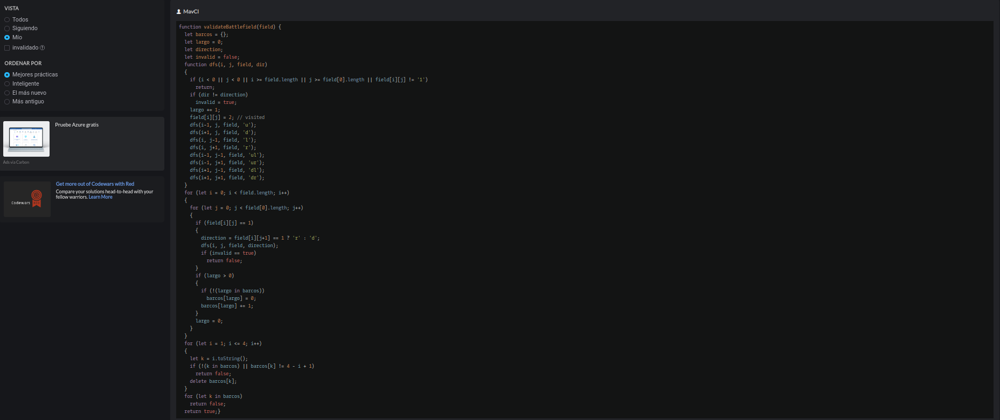

# Descripcion del problema
### Este problema nos pide crear una validacion de campos de batalla para el juego "batalla naval", para esto debemos tener en cuenta que el tablero es de 10 X 10, el barco puede ocupar una o mas celdas, los 0 en la cudricula son espacios bacios y los 1 es donde se encuentra un barco. Tambien se debe validar si los barcos son correctos como se ve en la siguiente imagen:

### El juego sigue las siguientes reglas:
- Debe haber un solo acorazado (tamaño de 4 celdas), 2 cruceros (tamaño 3), 3 destructores (tamaño 2) y 4 submarinos (tamaño 1). No se permiten barcos adicionales, así como barcos perdidos
- Cada barco debe ser una línea recta, excepto los submarinos, que son solo una celda
# Descripcion de los test
- Test 1: se valida un campo de batalla valido
- Test 2: se valida un campo de batalla invalido ya que se tienen barcos no deseados
- Test 3: se valida un campo invalido, ya que hay mas barcos de los previamente definidos
- Test 4: se valida que el numero de barcos sea el correcto, en este caso no lo es
# Capturas
