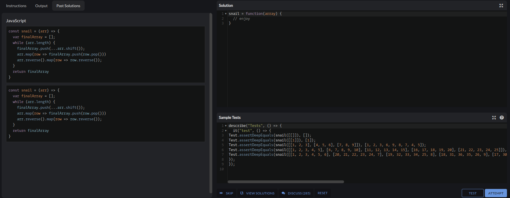

# Descripcion del problema
### La idea es que este algoritmo ordene las matrices de un largo indeterminado en forma de caracol, code wars nos da la siguinete imagen de guia:

# Descripcion de los test
- Test 1: se valida que para un arreglo vacio lo deje igual
- Test 2: se valida que un arreglo de largo 1 tambien quede igual
- Test 3: se valida que para largos variados cumpla la funcion y ordene de forma caracol
- Test 4: se valida que se ordene un matriz con digitos iguales
# Capturas
