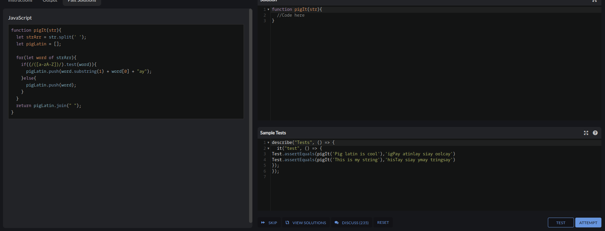

# Descripcion del problema
### En este ejercicio se nos dice que hay que tomar la ultima letra de cada palabra y moverla al final agregando un "ay"
# Descripcion de los test
- Test 1: se valida que haga el cambio en una plabra
- Test 2: se valida que no haga un cambio con los simbolos
- Test 3: se valida que para cualquier palabra larga le pueda hacer los cambios
# Capturas
