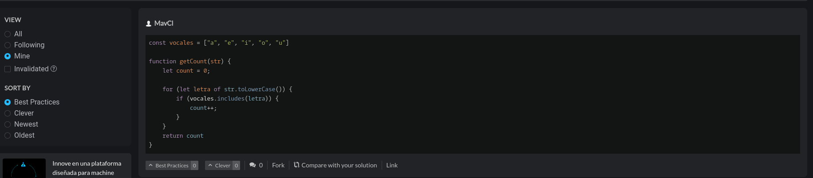

# Descripcion del problema
### En este ejercicio se nos dice que hay que retornar un recuento de las vocales de un string, tambien se nos dice que solo contara con minusculas y/o espacios

# Descripcion de los test
- Test 1: se valida que cuente las vocales en una palabra normal
- Test 2: se valida que en caso de no tener vocales el resultado sea 0
- Test 3: se valida que para cualquier palabra random se contabilize de manera correcta para esto se definen las letras y se hace un metodo para que las ordene de manera aleatoria con un largo aleatorio. 
# Capturas
