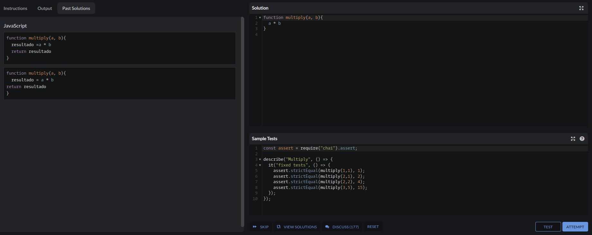

# Descripcion del problema

### En este ejercicio, nos pasan una funcion que no se ejecuta de manera correcta el cual es:

~~~ 
function multiply(a, b){
  a * b
  } 
  ~~~

### Nuestra tarea es lograr que esta funcion que permite multiplicar 2 numeros

# Descripcion de los test

- test 1: se valida la multiplicacion por 1
- test 2: se valida la multiplicacion por negativos
- test 3: se valida la multiplicacion por 0
- test 4: se valida la multiplicacion por numeros random, asi se ve que funciona para cualquier caso
# Capturas
